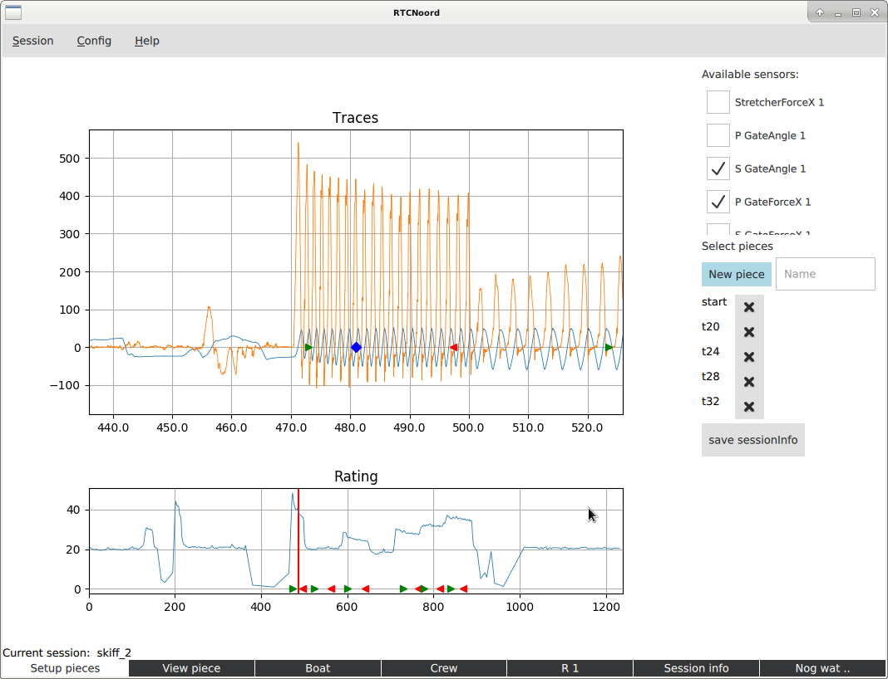
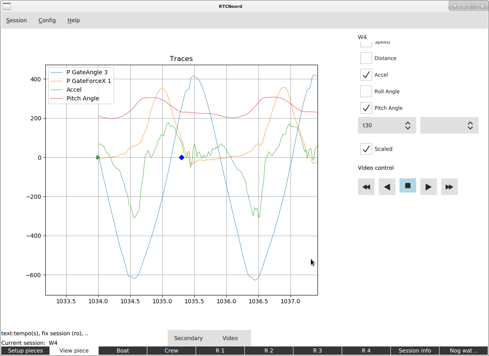
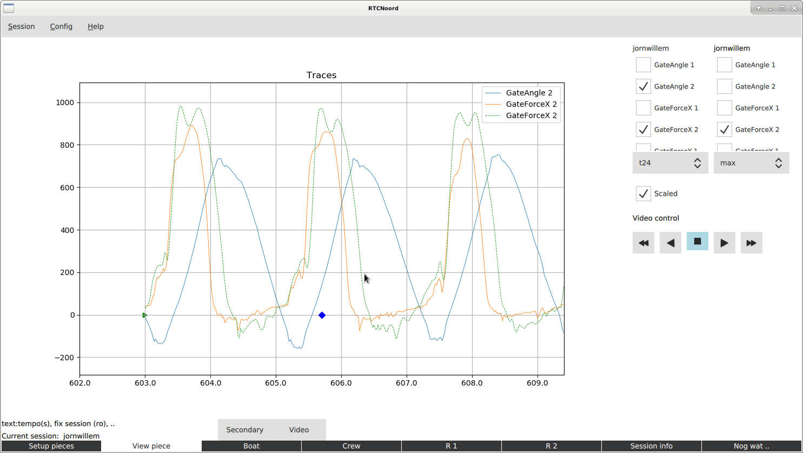
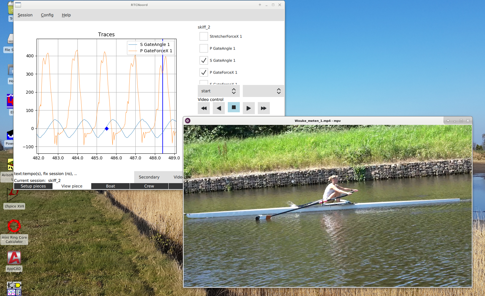
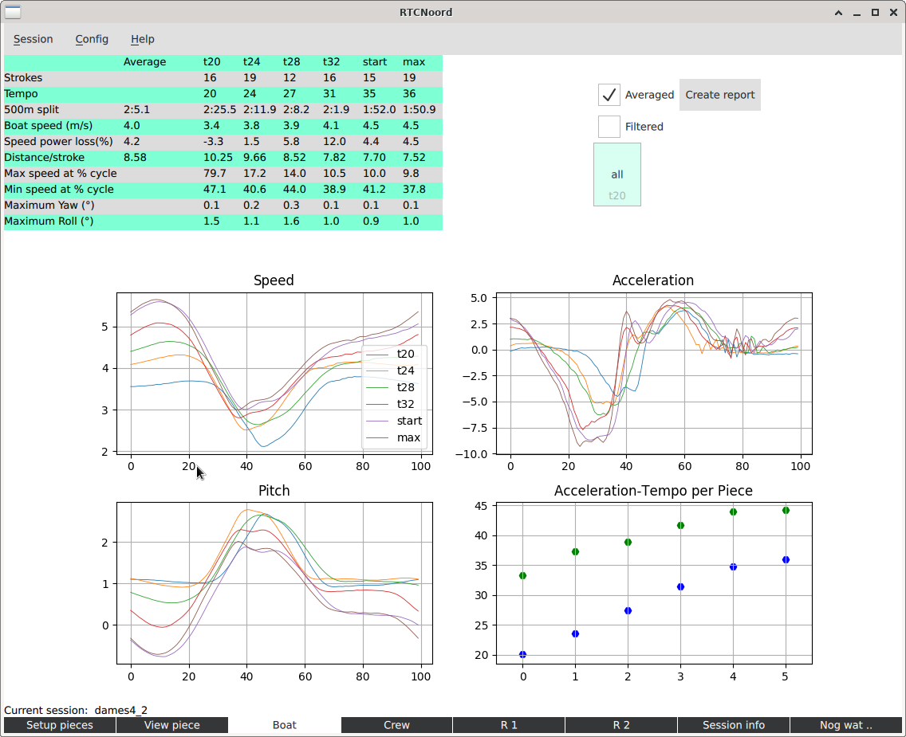
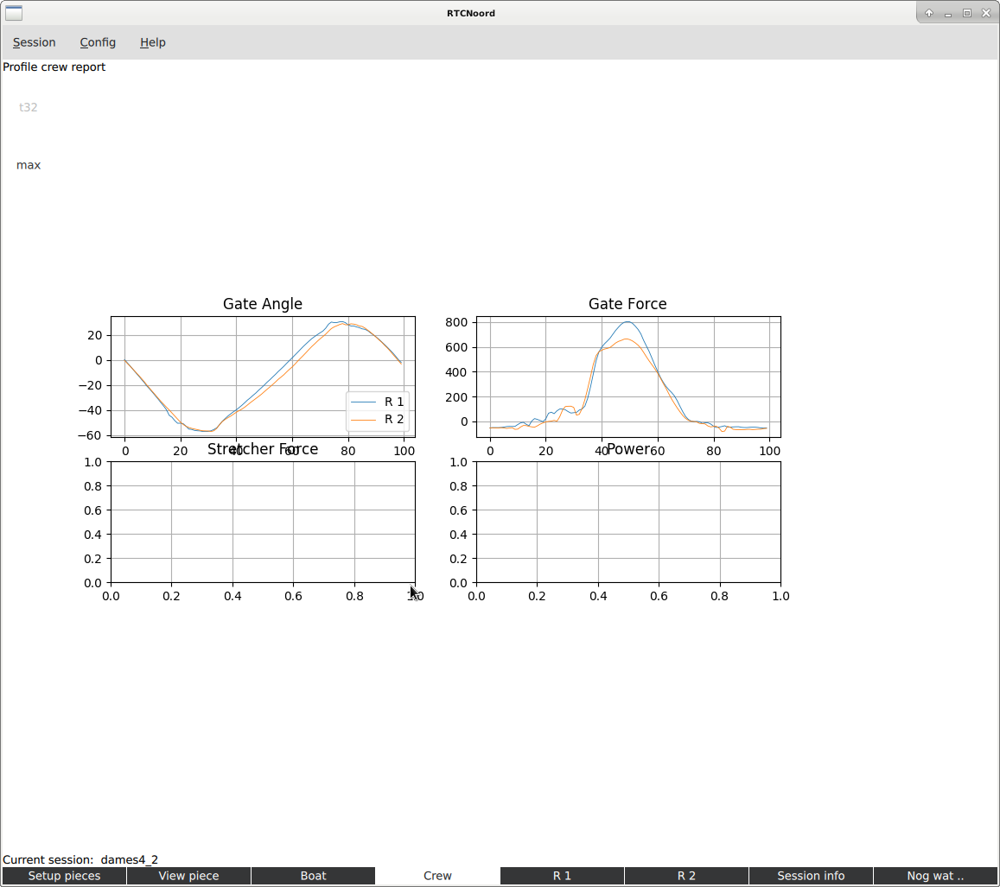
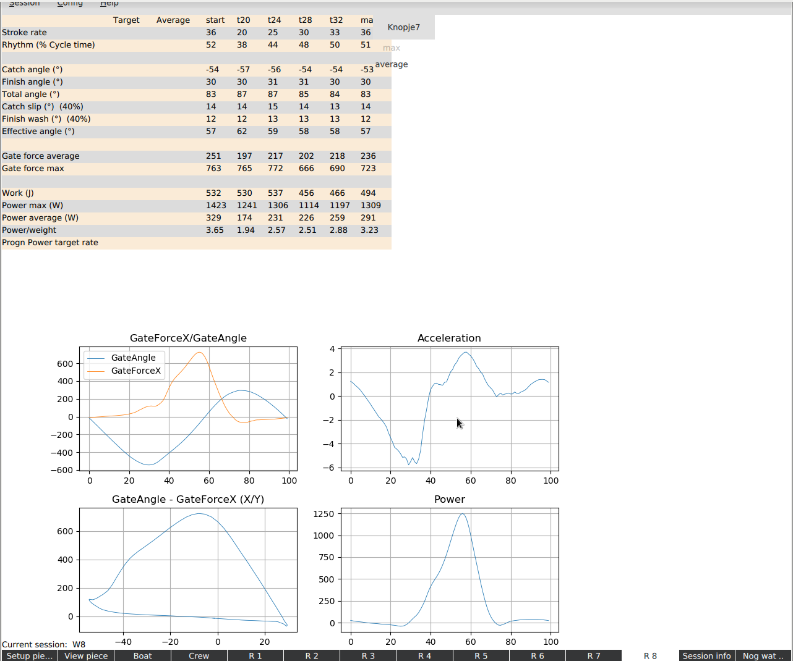
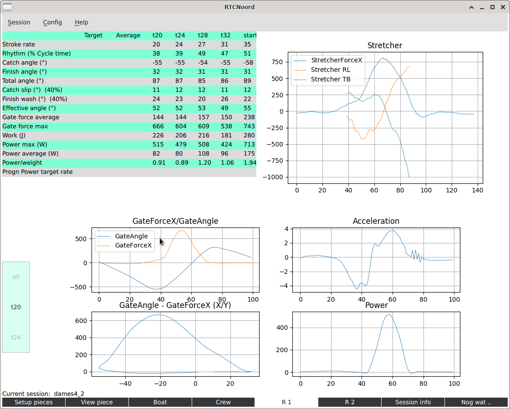

# RtcNoordApp

Process data from the Powerline system from Peach Innovations.
This system collects data from a rowing boat using various sensors.
The app is attempt to get higher level data out of the raw data from this system.

## Installation

It basically works on linux, windows and mac. See the docs directory for a short description of the install process on the different platforms.

## Usage

  - Start the program from the App directory with: "python main.py", or create an Icon on the desktop and use that.
  - The very first time the program is started a system dependant configuration-file RtcApp will be created where the "BaseDir" for all rowing data is set.
    The default value of BaseDir is RtcNoord in your home-directory.
    If that directory doesn't exist, it and a number of subdirectories will be created and filled with some data.
    With an upgrade of the software it probably is best to remove the BaseDir before starting the new version.
  - In the lower left part of the screens there is a status message.
  - Create a csv-file of the interesting part of a session using the Powerline software, creating a single piece and export the traces.
    Then paste that in, e.g, notepad. Finally put the result with a csv file extention in the csv-data directory, or a subdirectory thereof.
  - Name the csv with rowernames, date and powerline session number in the name, e.g JohnWill_250220_0123.csv
  - Save the file in the subdirectory for the correct year in csv_data.
  - Multiple csv-files can also be concatenated and used as the csv-file to create a session.
  - A few csv-files are already included.
  - Start the app and select the csv-file from the menu.
    Now data is preprocessed and saved in a sessionInfo-file and a dataObject-file.
  - Eventually session informatie will be added to the csv-file.
  - You can only access files that are in the csv- and session-data- directories.
  - You can create subdirectories in the csv-data to organize your data according to years e.g.
    These subdirectories will automatically be replicated in the session-data and reports directories.
  - There is a very basic backup mechanism if a session is created a second time. The previous session file wil be saved in a directory 'old'.
  - The program consists of several tabs that can be selected at the bottom of the screen.
      - Setup pieces: the interesting parts can be selected for further study.
      - View pieces: study the these parts in detail, comparing with data from another session, ...
      - Profile tabs: if pieces are selected a profile of the crew and individual rowers will be created.
          - Boat, Crew, and rower tabs.
      - Session info: configure the session, name the rowers, set calibration value
          - Important: fill in the session info when you use the csv-file for the first time! Eventually this data will reside in the csv-file so that it will nog get lost when recreating a session.

## Status

   - This is a basic working version. This is work in progress.

## Screenshots

Here a number screenshots to give an idea.
For the moment this part is also the rudimentary user guide.
Sessions can be created or selected from the menu at the top.
Below a description of the tabs.

### Setup Pieces

This normally is the first screen to use.
It is used to select the interesting pieces from the session.

We can select the different sensors by checking the sensors, here two sensors are selected.
Data from the currently selected pieces are shown in the right part of the screen.

The plot in the bottom part gives an overview of the entire rowing session, it shows the rating.
With it, the different parts of the session can be easily found.
If the csv-file consists of a number of parts, blue lines seperate them.

To select pieces click on the interesting part in the Rating plot.
That part is now shown above magnified, and sensordata can be seen when sensors have been selected.
A piece is created as follows: type the name of the piece, say "t20" in the field next to the "New piece" button.
Then click that button; it will turn green.
The next two clicks in the large plot define the beginning and end of the piece respectivily.
The buttons next to the pieces can be used to remove a piece.
The "save sessioninfo" button saves the pieces for use.

There is some panning and zooming possible with the mouse-wheel and right button.

### View Piece

In this tab we study the traces in more detail.
Some panning and zooming is also possible here.
The next screenshot shows a number of sensors, where they are scaled in such a way that the individual graphs are more or less the same size.

Using the "Secondary" button another session can be selected
In this way it is possible to view 2 different sessions next to each other to compare traces from these sessions.

Below two parts of the same session are shown one, with a stroke rate of 24 and the other with a rate of 30.
The plots are "normalized" in a crude way so that they overlap even if the rates are different, this to better compare the strokes.

### Using video

The View piece screen can also be used to connect a video session to the data.
To use this a video file has to be selected in the Session info tab.
After selecting a video via the button the video appears.
The video can be controlled with the video control button, apart from the middle one.
Clicking in the plot also positions the video.

The middle video control button is used the synchronise the video with the data as follows.
First position the video to a point where the data can be found that matches that point.
E.g. the first turning point of the oars at the intake after a start.
Then click the button, it will turn red; the video position is set.
Next click on the plot on the correct point in the data.
Finally click the button again. Synchronisation is complete.

### Boat Profile

If pieces are saved a table profiles the pieces.

To create a profile the data from the first stroke of the piece is used, or the average of the strokes.
Select averaging using the checkbox.
The data can also be filtered using the other checkbox. in which case the data of some sensors is filtered for a smoother response.

The plots show the selected (averaged/filtered) stroke that is used in profiling.
The plot shows exactly one stroke starting at the point that the stroke rower has his/here oar(s) perpendicular to the boat in the recover.
Using the tumble wheel we can select which pieces are shown in the plots.
All pieces, the individual pieces or the average of them can be selected.

The profile consists of this screen and the Crew- and Rower- screens, so creating a new profile will also affect those screens.
The "Create report" creates a pdf version of the profile, see the docs directory for an [example report](docs/example_report.pdf)

The report uses the selected settings of checkboxes and tumble wheels.
Also the view from "View piece" is shown in the report.

### Crew Profile

A number of plots to compare rowers in a crew.
The tumble wheel can be used to select the piece to look at, or the average can be used

### Rower Profiles

Each rower has its own profile part.
Again the tumble wheel can be used to select a single piece or the average.

### Session Info

In this tab some parts of the session can be configured: Crew name, Boat type, calibration value, venue, ..
Initially the boattype is inferred from the csvdata, but a custom type can be selected.
A skiff will always start with type Hx1, but it of course can be LD1x.

### Addition tabs

  -  X/Y plots
  -  A tab to use video separate from the rest. E.g. to easilty make a short loop in the video a a slow speed.
