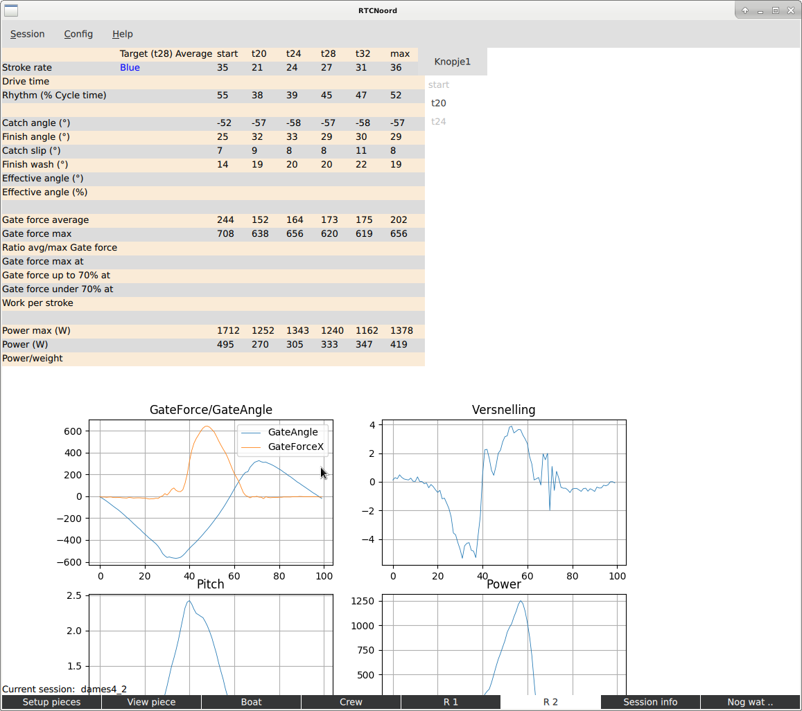

# RtcNoordApp

Process data from the Powerline system from Peach Innovations.
This system collects data from a rowing boat using various sensors.
The app is attempt to get higher level data out of the raw data from this system.

## Installation

It basically works on linux, windows and mac. See the docs directory for a short description of the install process on the different platforms.

## Usage

  - Start the program from the App directory with: "python main.py", or create an Icon on the desktop.
  - The very first time it is started a system dependant configurateion file RtcApp will be created where the "BaseDir" is set for all rowing data.
    It that directory doesn't exist, it and a number of subdirectories will be created.
    With an upgrade of the software it probably is best to remove these files before starting the new version.
  - Create a csv-file from the interesting part of a session using the Powerline software, creating a single piece and
    export the traces. Then paste that in, e.g, notepad. Finally put the result with a csv file extention in the csv-data directory, or a subdirectory thereof.
  - A few csv-files are already included.
  - Start the app and select the csv-file from the menu.
    Now data is preprocessed and saved in a sessionInfo-file and a dataObject-file.
    The csv-file is not used anymore.
  - Csv- and session-files not in the csv or session directory will be ignored.
  - There is a basic backup mechanism if a session is created a second time. The previous session file wil be (read-only) saved in a directory 'old'.
    This mainly to save info like crewname, and calibration value.
  - The program consists of several tabs that can be selected at the bottom of the screen.
      - Setup pieces: the interesting parts can be selected for further study.
      - View pieces: study the sensordata in detail, comparing with other session, ...
      - Profile tabs: if the proper pieces are selected a profile of the crew and individual rowers can be created.
          - Boat, Crew, and rower tabs.
	  
## Status

   - This is a basic version, most screens are (partly) working.

## Screenshots

Here a few screenshots to give an idea.
For the moment this part is also the rudimentary user guide.
Sessions can be created or selected from the menu at the top.
Below all tabs are described.

### Setup Pieces

This normally is the first screen to use.
It is used to select the interesting pieces from the session.
If a socalled "profile" is to be generated, a number of 6 mandatory pieces have to be selected.

We can select the different sensors by checking the sensors, here two sensors are selected.
The currently selected pieces are shown in the right part of the screen.

The plot below gives an overview of the entire rowing session, it shows the rating.
With it, the different part of the sessions can be easily found.

To select pieces click on the interesting part in the lower plot.
That part is shown above magified, and sensordata can be shown there.
A piece is created as follows: type the name of the piece, say "t20" in the field next to the "New piece" button.
Then click that button; it will turn red.
The next two clicks in the large plot define the beginning and end of the piece respectivily.
Finally click the button again; now the piece is created and shown below the button.
The buttons next to the pieces can be used to remove a piece.
The "save sessioninfo" button saves the pieces.

If pieces with names: start, t20, t24, t28, t32, and max are created, saving the pieces will also trigger the creation of the profile.

There is some panning and zooming possible with the mouse-wheel and right button.

### View Piece

In the View Piece tab we can study the traces in more detail.
The same panning and zooming is possible here.
In this example two different sessions are selected to compare traces from these sessions.
Using the "Secondary" button another session can be selected
Here data from a 4- and an 8+ are compared.

The plots are "normalized" in that they overlap even if the tempe's are different, this to better compare the strokes.

### Using video

The view piece screen can also be used to connect a video to the data.
After selecting a video via the button the video appears.
The video can be controlled with the video control butten, apart from the middle one.
Also clicking in the plot positions the video.

The middle video control button is used the synchronise the video with the data as follows.
First position the video to a point where the data can be found that matches that point.
E.g. the first turning point of the oars a the intake after a start.
Then click the button, it will turn red; the video time is set.
Next click on the plot on the correct point in the data.
Finally click the button again. Synchronisation is complete.

### Boat Profile

When the correct pieces are selected a profile is created to aid in the interpretation of the data.
The image shows a first version of this tab.

A profile is created using the button, but that is normally not needed, it will be done automatically when needed.
For example the profile can be created using the first stroke of each piece or using the average over each piece.
Clicking the checkbox will select that. A second or so later the new profile will appear.
The data can also be filtered using the other checkbox.
The profile consists of this screen and the Crew and Rowerscreens, zo creating a new profile will also affect those screens.
The "Create report" will create a pdf version of the profile, see the docs directory for an [example report](docs/example_report.pdf)

The plots show the selected (averaged/filtered) stroke that is used in profiling.
Using the tumble wheel below the create profile button all pieces or individual pieces can be selected.

### Crew Profile

A number of plots to compare rowers in a crew.
The tumble wheel can be used to select the piece to look at

### Rower Profiles

Each rower has its own profile part.
Again the tumble wheel can be used to select the piece.

### Session Info

In this tab some parts of the session can be configured: Crew name, calibration value, venue, ..
Not implemented.

### Addition tabs

  -  X/Y plots
  -  A tab to use video separate from the rest. E.g. to easilty make a short loop in the video a a slow speed.
