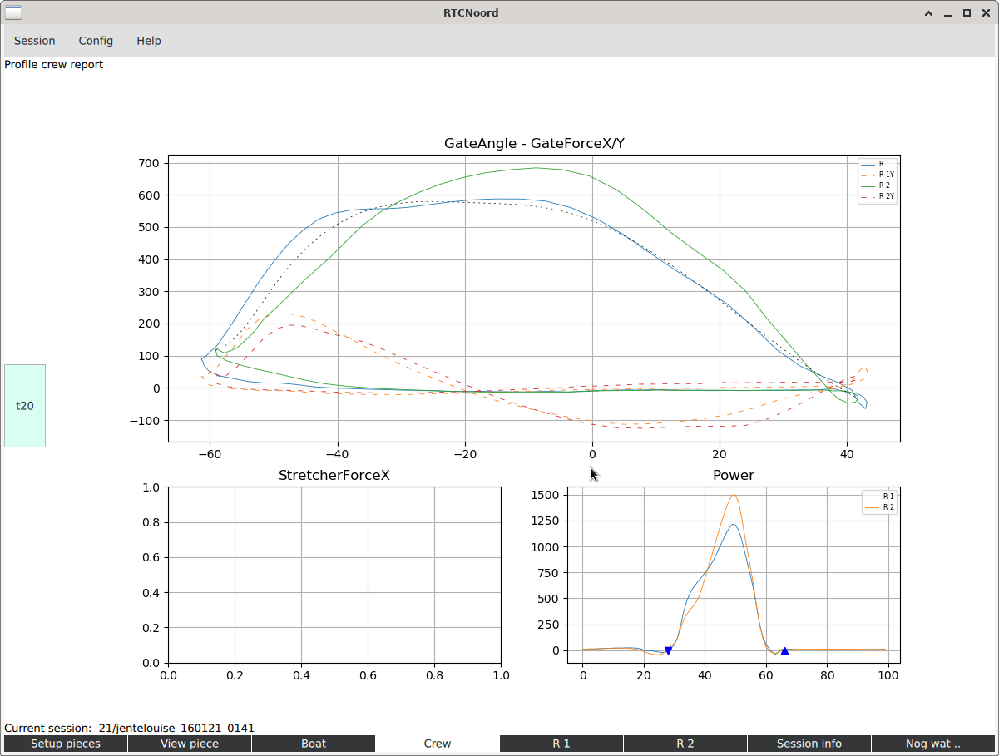
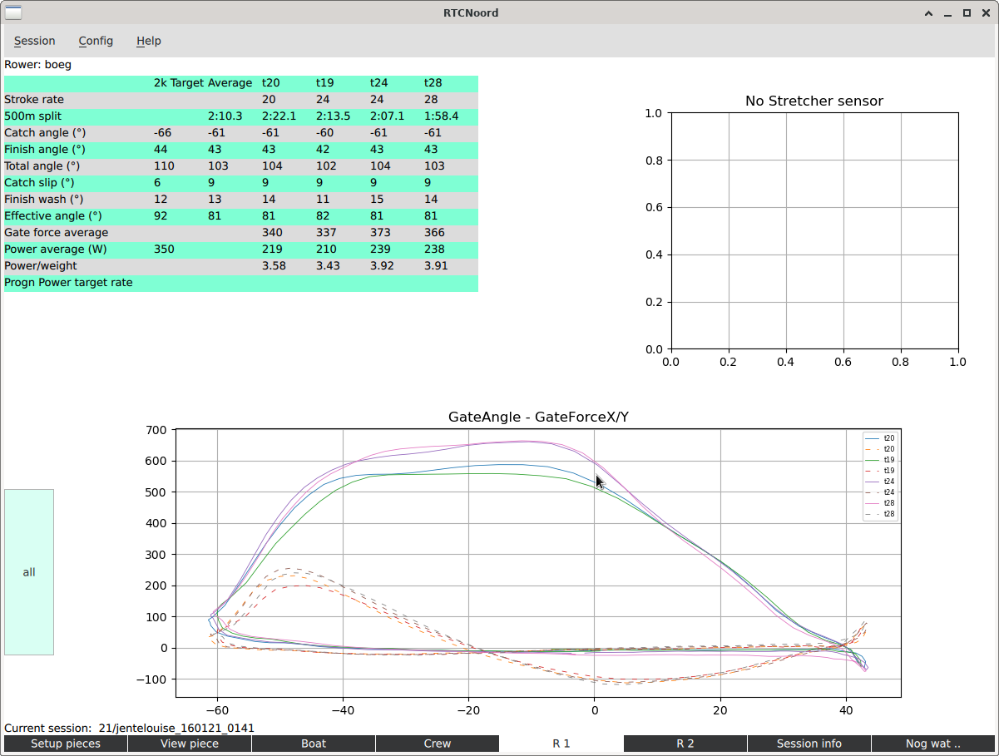

# RtcNoordApp

Process data from the Powerline system from Peach Innovations.
This system collects data from a rowing boat using various sensors.
The app is attempt to get higher level data out of the raw data from this system.

## Installation

It basically works on linux, windows and mac. See the appdocs directory for a short description of the install process on the different platforms.

## Usage

  - The data used in this app is to be exported from the Powerline software by selecting a piece and exporting it using "Export -> Trace data".
    This normally is a single piece that contains the all the interesting parts of the session.
    It is exported to the clipboard.
  - This data can be pasted in a csv-file using the Session menu: Create from clipboard (csv). 
  - Name the csv with rowernames, date and powerline session number in the name, e.g JohnWill_250220_0123. The csv extention will be added by the app.
    The csv-file can only be added into to the csv_data directory, or a subdirectory thereof, otherwise the command will be ignored.
    Using a year as the name of a subdirectory is one way of doing it.
    The csv_data directory is locate in the BaseDir, which defaults to RtcNoord in your home-directory.
  - Alternatively the clipboard can also be pasted into, for example a program such as notepad and then saved in the appropriate place.
  - Multiple csv-files can also be concatenated and used as the csv-file to create a session. There should be no empty lines between the parts.
  - A few csv-files are already included with the app. They have to be copied into the csv_data directory to become available.
  - Start the RtcNoordApp program from the App directory with: "python main.py", or create a link or an Icon on the desktop and use that. The advantage is the commandline is that there sometimes are warnings visible, so when in doubt, do start it from the command line.
  - When collecting data using the Peach system, do not forget to fill in at least the crewname(s) and the calibration factor for the distance in the Session Details of the Powerline software!
  - The very first time the program is started a system dependant configuration-file RtcApp will be created. It contains the value of the "BaseDir" which is where all rowing data is put and also the name of the current session.
    If that directory doesn't exist, it and a number of subdirectories will be created and filled with some data.
  - In the lower left part of the screens there is a status message.
  - To start working with the program select a csv-file using the menu.
    Now data is preprocessed and saved in a sessionInfo-file and a dataObject-file.
  - Now first go to the Session info tab to fill in the correct metadata.
    Metadata like, distance calibration value, rowernames etc. is prepended to the csv-file for it to be preserved with the data.
    Beware that each item is only entered by using the Enter key after typing in the value!
  - You can only access files that are in the csv- and session-data- directories.
  - You can create subdirectories in the csv-data to organize your data according to years for example.
    These subdirectories will automatically be replicated in the session-data and reports directories.
  - There is a very basic backup mechanism if a session is created a second time. The previous session file wil be saved in a directory 'old'.
  - The program consists of several tabs that can be selected at the bottom of the screen.
      - Setup pieces: the interesting parts can be selected for further study.
      - View pieces: study the these parts in detail, comparing with data from another session. Also a video(frame) of the session can be shown if available.
      - Profile tabs: if pieces are selected/saved a profile of the boat, crew and individual rowers will be created.
          - Boat, Crew, and rower tabs.
      - Session info: configure the session, name the rowers, set calibration value
          - Important: fill in the session info when you use the csv-file for the first time! Eventually this data will reside in the csv-file so that it will nog get lost when recreating a session.
   - A first piece only can be selected after a number of complete strokes have been done.
   - It the program crashes, please delete the current session file in the session_data directory to recover.
   - There also is a basic interactive way to manipulate the data in a python session.

## Status

   - This is a basic working version. This is work in progress.

## Screenshots

Here a number screenshots to give an idea.
For the moment this part is also the rudimentary user guide.
Sessions can be created or selected from the menu at the top.
Below a description of the tabs.

### Setup Pieces

This normally is the first screen to use.
It is used to select the interesting pieces from the session.

We can select the different sensors by checking the sensors, here two sensors are selected.
Data from the currently selected pieces are shown in the right part of the screen.

In the report properties are distilled from the pieces into some tables.
It is, for the these properties to be as usefull as possible, important to select the pieces in such a way that rowing is constant within the piece.
So no starts of variations in tempo and power.

You can of course select a start in a piece, but most properties mentioned in the tables, like power, are not very usefull.
In such a case you probably will look more to the plots in the View piece tab.

The plot in the bottom part gives an overview of the entire rowing session, it shows the rating.
With it, the different parts of the session can be easily found.
If the csv-file consists of a number of parts, blue lines seperate them.

To select pieces click on the interesting part in the Rating plot.
That part is now shown above magnified, and sensordata can be seen when sensors have been selected.
A piece is created as follows: type the name of the piece, say "t20" in the field next to the "New piece" button.
Then click that button; it will turn green.
The next two clicks in the large plot define the beginning and end of the piece respectivily.
The buttons next to the pieces can be used to remove a piece.
The "save sessioninfo" button saves the pieces for use.

There is some panning and zooming possible with the mouse-wheel and right button.
Clicking in the Traces plot shows the tempo at that point in the lower right of the window.

### View Piece

In this tab we study the traces in more detail.
Panning and zooming is also possible here.
Clicking on a line displays the sensors value.
The next screenshot shows a number of selected sensors.
If the magnitude of the different signals differ alot, they cannot be seen properly.
Using the Scaled button changes the scales of the different signals so that each signal can be seen better.

Using the "Secondary" button another session can be selected
In this way it is possible to view 2 different sessions next to each other to compare traces from these sessions.

The plots are "normalized" in a crude way so that they overlap even if the rates are different, this to better compare the strokes.
This is only done by scaling the first two strokes of the secondary session to the first session.
Also, using the slider on the right, the secondary plot can moved a little bit with respect to the main session.
To use the slider look at the first two strokes in the piece and select the (port) gate angles of the strokes.
Then try to use the slider to make the strokes align better.

Below the main session is data from a pair where the force curve of the stroke is shown. The plot of the secondary session (dotted line) is of the same rower but now from a skiff session.

### Using video

When a video is made during the session it is possible to show the video (frames) next to the data, where a connection is made between the frame and the point in the data.
This is done in the View piece tab.

To use this a video file name has to be selected in the Session info tab.
Be sure that the proper piece is selected when doing this.
The file should reside in the RtcNoord/videos directory.
Then clicking on the Video button in the View page tab will show the video frame with the associated data frame.
The video can be controlled with the video control buttons to move a single or a larger number of frames.
Clicking in the plot also positions the video.
A red line is the initial position of the video upon start and a blue line shows the place in the data of which the video frame is shown.

The middle button is used to synchronize the video with the data as follows.
First position the video to a point of which you know the place in the data.
E.g. the first turning point of the oars at the intake after a start.
Note that the blue line follows the video.
Then click the middle control button, it will turn red; the video position is set.
Next click on the plot on the correct point in the data. Now the red line is positioned.
Finally click the middle control button again. The blue line moves to that point and synchronisation is complete.

### Boat Profile

If pieces are saved a table profiles the pieces.

To create a profile the data from the first stroke of the piece is used, or the average of the strokes.
Select averaging using the checkbox.
The data can also be filtered using the other checkbox. in which case the data of some sensors is filtered for a smoother response.

The plots show the selected (averaged/filtered) stroke that is used in profiling.
The plot shows exactly one stroke starting at the point that the stroke rower has his/here oar(s) perpendicular to the boat in the recover.
Using the tumble wheel we can select which pieces are shown in the plots.
All pieces, the individual pieces or the average of them can be selected.

The profile consists of this screen and the Crew- and Rower- screens, so creating a new profile will also affect those screens.
The "Create report" creates a pdf version of the profile, see the appdocs directory for an [example report](appdocs/example_report.pdf).
It also creates a spreadsheet that contains the tables for further processing, see [example sheet](appdocs/example_report.xlsx).

It is important to note that the report uses the selected settings of checkboxes and tumble wheels.
So beware what is the most interesting piece for the report.
Also, if set, the view from "View piece" is shown in the report.

### Crew Profile

A number of plots to compare rowers in a crew.
The most important plot is the angle versus force plot, X and Y.
The black curve is a reference curve.
The tumble wheel can be used to select the piece to look at, or the average can be used

### Rower Profiles

Each rower has its own profile part.
Again the tumble wheel can be used to select all piece, a single one or the average of them.

### Session Info

In this tab some parts of the session can be configured: Crew name, Boat type, calibration value, venue, video, ..
Initially the boattype is inferred from the csvdata, but a custom type can be selected.

Be sure to set the values the very first time the session is created from the csv-data.
Note that an item only is really entered when the enter key is used after entering the value!

### Addition tabs

  -  X/Y plots
  -  A tab to use video separate from the rest. E.g. to easilty make a short loop in the video a a slow speed.

### Advanced use

It is possible to use the data from a session directly in python.
There prototyping and other experiments on the data can be done from the python prompt.
To do this, start python3 in the RtcNoordApp directory.

Then after the following commands

    import globalData as gd
    import main
    main.interactive()

data from the session can be viewed, for example

    gd.sessionInfo
    import matplotlib.pyplot as plt

    gd.dataObject.shape
    plt.plot(gd.dataObject[:, 2])
    gd.norm_arrays.shape
    plt.plot(gd.norm_arrays[0, :, 17])

    plt.show()

    result = main.myFirstExtension(1000)
    plt.plot(result)
    plt.show()
    

